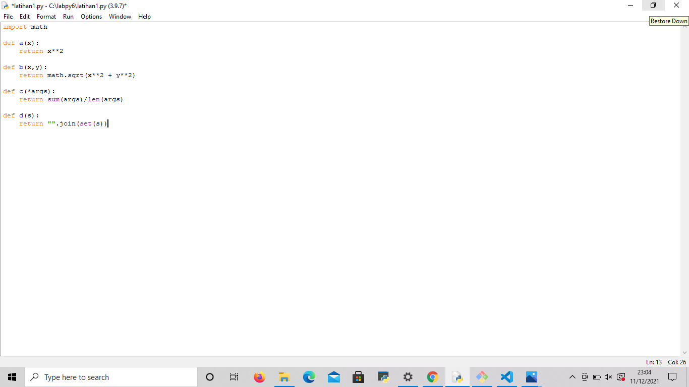
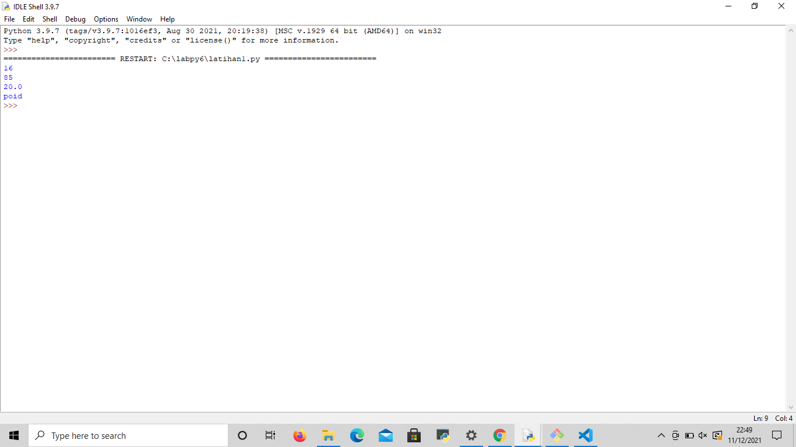
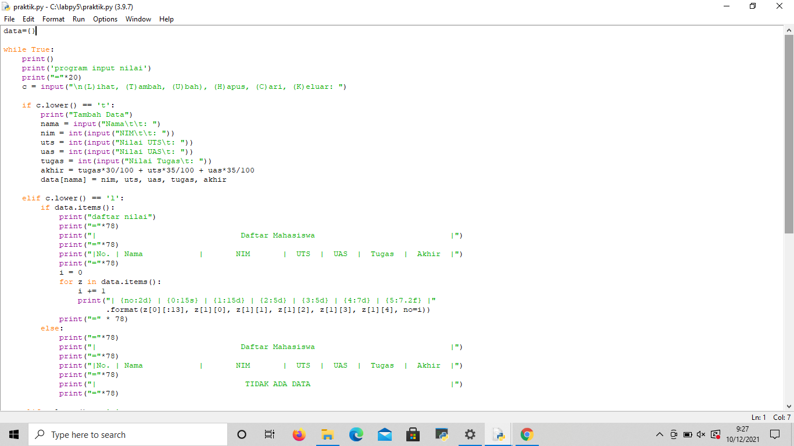
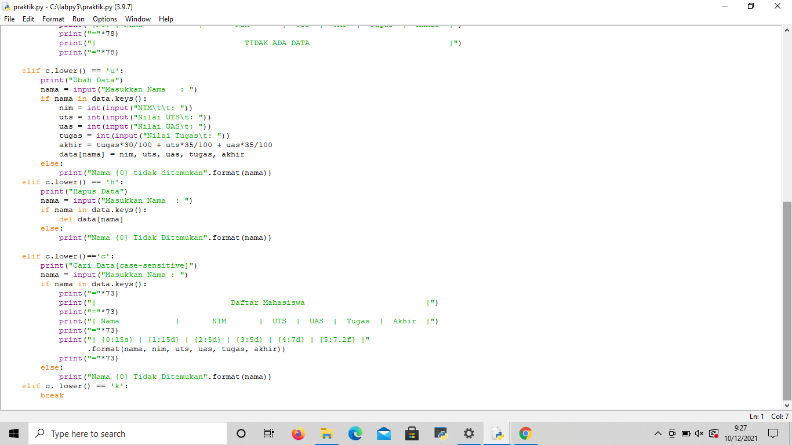

# labpy6
__________________________
nama: ade maulani bilgis<p>
nim: 312110180<p>
kelas: TI.21.A.1<p>
__________________________

## LATIHAN
- ubahlah kode di bawah ini menjadi fungsi _lambda_
 
 - kode yang telah di ubah
 
 - menggunakan import math pada fungsi
 di atas contoh dari fungsi lambda
 * perpangkatan
 * perpangkatan dan penjumlahan
 * mencari nilai rata-rata
 * mengubah posisi nilai yang di inputkan menjadi tidak beraturan

## praktikum
buatlah program sederhana dengan mengaplikasikan fungsi yang akan menampilkan daftar nilai mahasiswa:
langkah awal kita haru membuat dictinoary kosong debagai database<p>
- fungsi **tambah()** untuk menambah data
```py
def tambah():
    print("TAMBAH DATA")
    print("------------")
    nama = input("Nama Mahasiswa\t: ")
    nim = int(input("NIM Mahasiswa\t: "))
    tugas = int(input("Nilai Tugas\t: "))
    uts = int(input("Nilai UTS\t: "))
    uas = int(input("Nilai UAS\t: "))
    akhir = (tugas*30/100) + (uts*35/100) + (uas*35/100)
    daftar[nama] = [nim, tugas, uts, uas, akhir]
    print()
```
- fungsi **lihat()** untuk  melihat data
jika anda belum mengisi data maka yang akan istem akan memanggil fungsi **no data()**
```py
def lihat():
if len(daftar) <= 0:
    no_data()
else:
    print("DAFTAR NILAI")
    print("------------")
    print(72*"=")
    print("| {0:^10} | {1:^10} | {2:^6} | {3:^6} | {4:^6} |   {5:^12}  |".format("NIM", "NAMA", "TUGAS", "UTS", "UAS", "NILAI AKHIR"))
    print(72*"=")
    for z in daftar.items():
        print(f"| {z[1][0]:>10} | {z[0]:>10} | {z[1][1]:>6} | {z[1][2]:>6} | {z[1][3]:>6} |   {z[1][4]:>12}  |") 
        print(72*"=")
    print()
```
- fungsi **ubah()**
fungsi ubah bisa mengubah data yang sebelumnya.<p>
```py
def ubah():
if len(daftar) <= 0:
    no_data()
else :
    print("UBAH DATA")
    print("-----------")
    nama = input("Nama Anda\t: ")
    if nama in daftar.keys():
        nim = int(input("NIM Mahasiswa\t: "))
        tugas = int(input("Nilai Tugas\t: "))
        uts = int(input("Nilai UTS\t: "))
        uas = int(input("Nilai UAS\t: "))
        akhir = (tugas*30/100) + (uts*35/100) + (uas*35/100)
        daftar[nama] = [nim, tugas, uts, uas, akhir] 
        print()
```
- fungsi **hapus()**
fungsi hapus data berguna untuk menghapus data yang telah di input.<p>
```py
def hapus():
if len(daftar) <=0:
    no_data()
else:
    print("HAPUS DATA")
    print("-----------")
    nama = input("Nama Anda\t: ")
    if nama in daftar.keys():
        del daftar[nama]
        print()
```
hasil **input**


hasil **output**


**selesai**